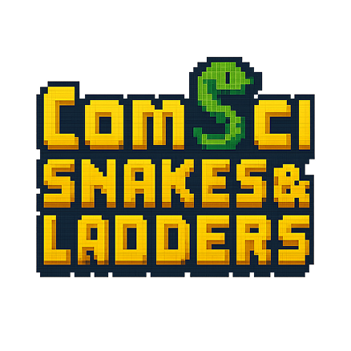

# ComSci Snakes & Ladders

เกมบันไดงู(sec1) มาดูงูห้องเรามั้ย



A Python/Pygame project: a digital version of the classic Snakes and Ladders board game, themed for the Department of Mathematics and Computer Science Chulalongkorn university.

## Features
- Playable digital Snakes and Ladders game
- Animated buttons and logo
- Custom pixel art assets
- Simple, intuitive interface
- Special mode

## How to Play
1. Each player takes turns rolling the dice.
2. Move your token forward by the number shown on the dice.
3. If you land at the bottom of a ladder, climb up to the top.
4. If you land on the head of a snake, slide down to the tail.
5. The first player to reach the final square wins.
6. If your roll would take you past the last square, stay in place and wait for your next turn.

## Getting Started
1. Install Python 3.x
2. Clone this repository and
   ```bash
   pip install -r requirements.txt
   ```
3. Run the game:
   ```bash
   python main.py
   ```

## Project Structure
- `main.py` — Main game logic and menu
- `assets/` — All images and art assets
- `README.md` — Project documentation

## License
This project is for educational purposes.

---
